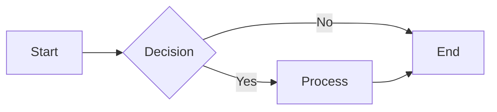

# Document With Mermaid Graphic

This test file includes a Mermaid diagram so you can verify that the pandoc-mermaid filter runs and that the diagram appears in the generated Word document.

## Overview

The diagram below shows a simple flowchart. In the workflow, the Mermaid CLI will render it to an image before Pandoc produces the .docx.

## Flowchart

## After the diagram

This paragraph comes after the Mermaid block. In Word you should see the flowchart as an image between the "Flowchart" heading and this paragraph.

## Summary

- Use **simple-doc.md** to test conversion without Mermaid.
- Use **doc-with-mermaid.md** to test conversion with a Mermaid diagram.

End of document.
